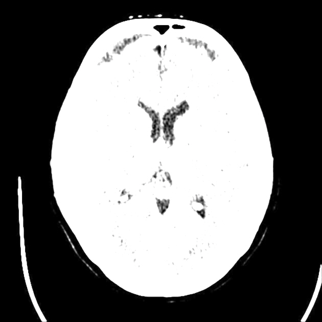
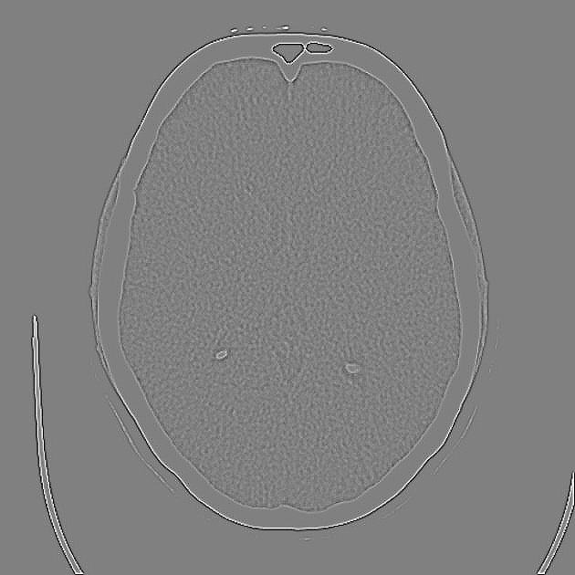
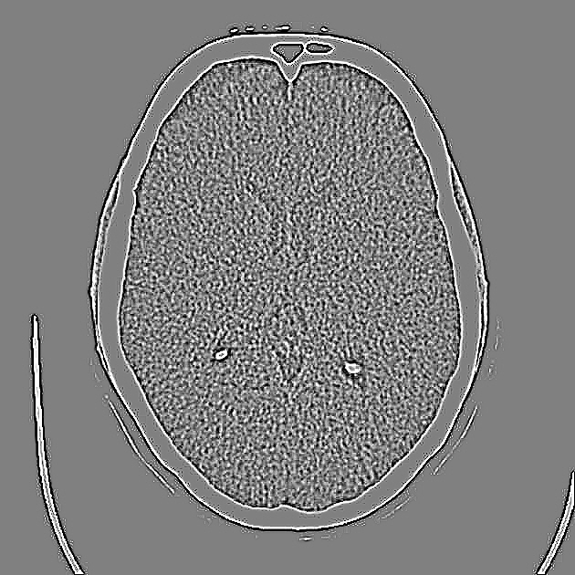
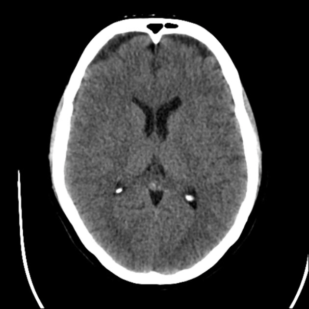
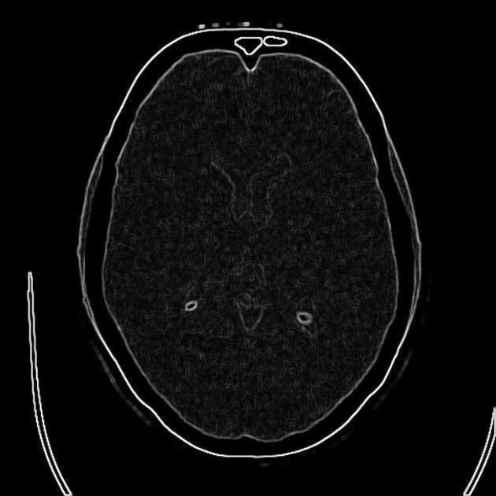
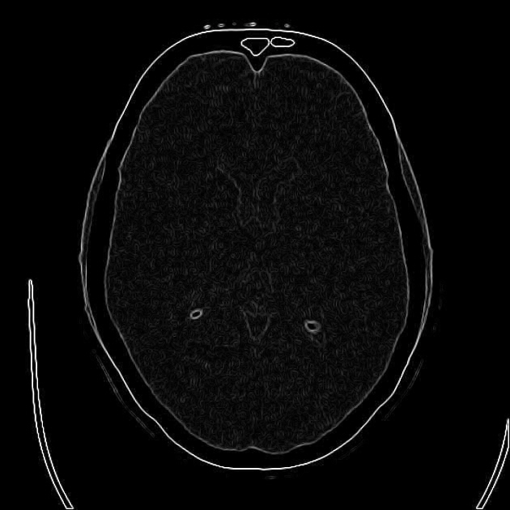
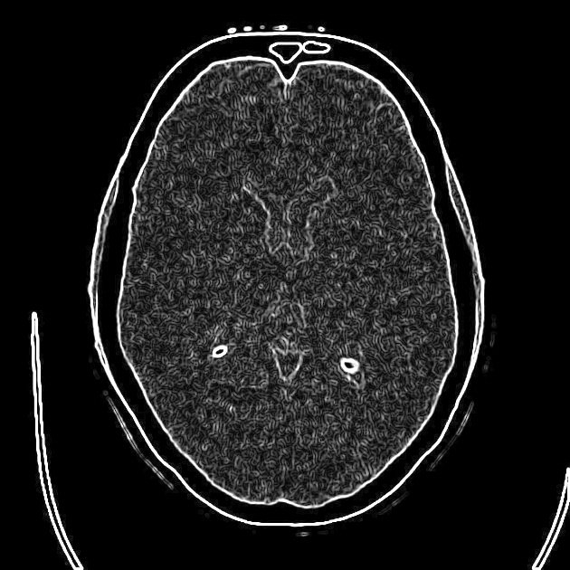

---

# BrainCT_C_PY_Verilog

---

### 의료 영상 처리 필터 가이드

|No|필터이름|적용분야|기능|결과|
|:---:|:---:|:---:|:---:|:---:|
| 1 | [Bilateral Filter](#bilateral-엣지-보존-스무딩-조직-경계) | 엣지 보존 스무딩 (조직 경계) | 노이즈 제거 필터 | |
| 2 | [Emboss Filter](#emboss-3d-효과-조직-질감-분석) | 3D 효과 (조직 질감 분석) | 이미지 향상 필터 |   |
| 3 | [Gaussian Filter](#gaussian-노이즈-제거-mrict-전처리) | 가우시안 노이즈 제거 (MRI/CT 전처리) | 노이즈 제거 필터 |  |
| 4 | [High-pass Filter](#high-pass-세부-정보-강조-미세-구조) | 세부 정보 강조 (미세 구조) | 이미지 향상 필터 |    |
| 5 | [Laplacian Filter](#laplacian-경계-검출-종양-분할) | 경계 검출 (종양 분할) | 엣지 및 경계 검출 필터 |   |
| 6 | [LoG Filter](#log-laplacian-of-gaussian-혈관-검출) | Laplacian of Gaussian (혈관 검출) | 엣지 및 경계 검출 필터 |   |
| 7 | [Median Filter](#median-salt-and-pepper-노이즈-제거-x-ray) | Salt-and-pepper 노이즈 제거 (X-ray) | 노이즈 제거 필터 |   |
| 8 | [Morphological Gradient](#morphological-gradient-경계-강조-세포-분할) | 경계 강조 (세포 분할) | 엣지 및 경계 검출 필터 |  |
| 9 | [Motion Blur](#motion-blur-움직임-효과-아티팩트-연구) | 움직임 효과 (아티팩트 연구) | 특수 효과 필터 |   |
| 10 | [Prewitt Filter](#prewitt-엣지-검출-장기-경계) | 엣지 검출 (장기 경계) | 엣지 및 경계 검출 필터 |  |
| 11 | [Roberts Filter](#roberts-빠른-엣지-검출-실시간-처리) | 빠른 엣지 검출 (실시간 처리) | 엣지 및 경계 검출 필터 |  |
| 12 | [Sobel Filter](#sobel-filter) | 엣지 검출 (해부학적 구조 분석) | 엣지 및 경계 검출 필터 |  |
| 13 | [Unsharp Mask](#unsharp-mask-이미지-선명화-해상도-향상) | 이미지 선명화 (해상도 향상) | 이미지 향상 필터 |  |

#define _CRT_SECURE_NO_WARNINGS


---

# Sobel Filter


<br>

## 1. C : Visual Studio
### BMP 파일 mem 파일 변환(C)
  * 다운로드 후 압축 해지 후 \sobel\sobel\sobel.sln 를 실행
  * Ctrl + F5


<br>

<br>

<br>

## 2. Python
### BMP 파일 mem 파일 변환(Python)

```   
cd sobel
```
```
python conv-bmp.py
```


### mem 파일 변환, sobel 필터 적용 결과 비교 (C/Python)
```
python compfile.py
```


## Verilog (sobel_edge_frame.v, sobel_edge_tb.v)
   * 다운로드 후 압축 해지 후 \sobel\verilog\sobel.mpf 를 프로젝트로 읽어 들임.
   * compile 후 run 8ms


<br>


   * 다이얼로그에서 "아니오(N)" 선책


<br>

---

   * Verilog에서 이미지를 라인 단위로 읽을 때 발생하던 OS별 개행 및 EOF 처리 문제를, 전체 메모리 기반 일괄 로드 방식으로 바꾸면서 완전히 해결
      * BMP (시각적 결과)
      * MEM (픽셀 값 데이터)
      * 가 모두 비트 단위까지 완전 동일(✅) 하게 동작합니다.

```
python compare_gui.py
```


<br>

<br>

---


<br>

<br>

#### sobel_edge_frame.v

```
┌──────────────────────────────────────────────────────────────────────────────┐
│                              sobel_edge_frame                               │
│  (parameters) IMG_W, IMG_H, NPIX = IMG_W*IMG_H                               │
│                                                                              │
│        clk  rst_n  start                                                     │
│         │     │      │                                                       │
│         │     │      └──────────────┐                                        │
│         │     │                     │                                        │
│         │     └──────────┐          │                                        │
│         │                │          │                                        │
│  ┌──────▼──────┐   ┌─────▼──────┐   │                                        │
│  │  Control    │   │ Index/Loop │   │                                        │
│  │    FSM      │   │  Generator │◄──┘   states: IDLE→LOAD→PROC→FINISH→DONE   │
│  │(state,next) │   │ (x,y,idx)  │       (done)                               │
│  └──────┬──────┘   └─────┬──────┘                                           │
│         │                │ idx                                              │
│         │             ┌──▼──────────────────────────────────────┐           │
│         │             │   Window Generator (3×3 neighborhood)   │           │
│         │             │   - src[idx + offset]                    │           │
│         │             │   - boundary clamp(x±1, y±1)             │
│         │             │   - out: p00..p22 (8-bit each)           │
│         │             └───┬──────────────────────────────────────┘
│         │                 │ p00..p22
│         │     ┌───────────▼───────────────┐     ┌───────────▼───────────────┐
│         │     │  Convolution (Gx)         │     │  Convolution (Gy)         │
│         │     │  Kx = [-1 0  1;           │     │  Ky = [-1 -2 -1;          │
│         │     │        -2 0  2;           │     │        0   0  0;          │
│         │     │        -1 0  1]           │     │        1   2  1]          │
│         │     │  out: Gx (signed wide)    │     │  out: Gy (signed wide)    │
│         │     └───────────┬───────────────┘     └───────────┬───────────────┘
│         │                 │                                 │
│         │     ┌───────────▼──────────┐           ┌──────────▼──────────┐
│         │     │   abs(Gx)            │           │    abs(Gy)          │
│         │     └───────────┬──────────┘           └─────────┬───────────┘
│         │                 │                                │
│         │                 └───────────────┬────────────────┘
│         │                                 │  (L1 norm)
│         │                     ┌───────────▼───────────┐
│         │                     │  Sum = |Gx| + |Gy|    │
│         │                     └───────────┬───────────┘
│         │                                 │
│         │                     ┌───────────▼───────────┐
│         │                     │  Clamp 0..255 (8-bit) │
│         │                     └───────────┬───────────┘
│         │                                 │ edge_pix (8b)
│         │                    ┌────────────▼────────────┐
│         │                    │ Dst Frame Buffer edge[] │◄───── write @ idx
│         │                    └─────────────────────────┘
│         │
│  src[] ─┴─────────────────────────────────────────────────────────► WindowGen
│         (TB가 $readmemh로 채움)                                     (read)
│
│  edge[] ───────────────────────────────────────────────────────────► TB가 dump
│         (TB가 파일로 저장: MEM/BMP)
│
└──────────────────────────────────────────────────────────────────────────────┘

```

#### sobel_edge_tb.v

```
┌──────────────────────────────────────────────────────────────────────────────┐
│                               sobel_edge_tb                                  │
│   (시뮬 전용 TB: 파일 I/O + DUT 구동 + 결과 저장)                             │
│                                                                              │
│                ┌───────────────────────────────────────────────────┐         │
│   input_image.mem  --$readmemh-->  src[0..NPIX-1]  ─────────────┐  │         │
│                └───────────────────────────────────────────────────┘         │
│                                                              │               │
│  ┌─────────────┐     ┌──────────────┐      ┌───────────────┐  │               │
│  │  Clock Gen  │───►│ Reset/Start  │─────►│   DUT Driver  │──┼──────┐        │
│  │  (always)   │     │  Sequencer   │      │ (stimulus)    │  │      │        │
│  └─────────────┘     └──────────────┘      └───────────────┘  │      │        │
│        │ clk                  │ rst_n,start                        │      │        │
│        ▼                      ▼                                    ▼      ▼        │
│  ┌─────────────────────────────────────────────────────────────────────────────┐  │
│  │                           sobel_edge_frame (DUT)                           │  │
│  │  - IMG_W/IMG_H 파라미터                                                     │  │
│  │  - src[] 읽어 3×3 윈도우/Sobel/abs-sum/clamp → edge[] 기록                 │  │
│  │  - 내부 FSM: IDLE→LOAD→PROC→FIN→DONE                                       │  │
│  └─────────────────────────────────────────────────────────────────────────────┘  │
│        │ edge_pix / 내부 완료 조건(또는 TB 상태 감시)                                 │
│        ▼                                                                           │
│  ┌─────────────────────────────────────────────────────────────────────────────┐  │
│  │                         Capture / Frame Buffers                             │  │
│  │   - edge[0..NPIX-1]  (DUT 결과 프레임)                                      │  │
│  │   - (옵션) gray[0..NPIX-1] or src[] 그대로                                   │  │
│  └─────────────────────────────────────────────────────────────────────────────┘  │
│        │                                                                           │
│        ├────────────►  output_edge-*.mem   ($fwrite "%02X\r\n")                    │
│        │                                                                           │
│        ├────────────►  output_image-*.mem  ($fwrite "%02X\r\n") 〔선택: src/gray〕  │
│        │                                                                           │
│        └────────────►  BMP Writer (팔레트 + 헤더 + bottom-up 픽셀)                 │
│                         ├── output_edge-*.bmp                                      │
│                         └── output_grayscale-*.bmp                                 │
│                                                                              │
│  [진행 메시지/에러 핸들링]                                                     │
│   - $display로 진행 로그                                                       │
│   - 파일 열기 실패/쓰기 실패 시 $fatal/$finish                                 │
│                                                                              │
└──────────────────────────────────────────────────────────────────────────────┘

```

---
# Gaussian: 노이즈 제거 (MRI/CT 전처리)
---
# Median: Salt-and-pepper 노이즈 제거 (X-ray)
---
# Laplacian: 경계 검출 (종양 분할)
---
# Prewitt: 엣지 검출 (장기 경계)
---
# Roberts: 빠른 엣지 검출 (실시간 처리)
---
# Unsharp Mask: 이미지 선명화 (해상도 향상)
---
# Emboss: 3D 효과 (조직 질감 분석)
---
# High-pass: 세부 정보 강조 (미세 구조)
---
# Motion Blur: 움직임 효과 (아티팩트 연구)
---
# LoG: Laplacian of Gaussian (혈관 검출)
---
# Morphological Gradient: 경계 강조 (세포 분할)
---
# Bilateral: 엣지 보존 스무딩 (조직 경계)
---


