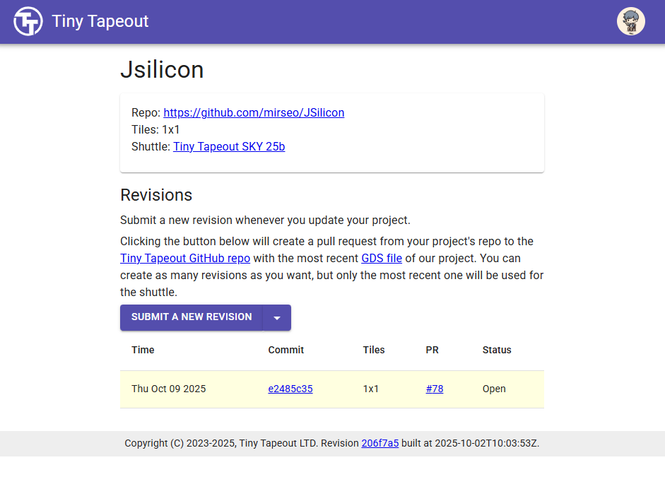

   

<!---

This file is used to generate your project datasheet. Please fill in the information below and delete any unused
sections.

You can also include images in this folder and reference them in the markdown. Each image must be less than
512 kb in size, and the combined size of all images must be less than 1 MB.
-->

<!-- gds render image -->
<!--  -->

## JSilicon v0.2 – A Dual-Mode 8-bit CPU/ALU Core
A JavaScript-Inspired Prototype Built Under Constraint  

**JSilicon** is an **8-bit CPU/ALU core** designed and implemented from scratch during my mandatory military service in South Korea (2025). This project serves as a proof-of-concept, showing that a complete silicon design is achievable even in highly constrained environments.  

Version 0.2 expands on the original manual ALU functionality by adding a CPU mode that automatically executes pre-programmed instructions. To enable this, key CPU components such as a Program Counter (PC), an instruction decoder, and a register file have been integrated.  

Inspired by JavaScript's simplicity and the philosophy of accessible silicon design, the JSilicon series aims to develop an ASIC that can natively power a JS runtime.  

## Overview  
- **PC (Program Counter & ROM)** - Stores a 16x8-bit instruction set in its internal ROM and sequentially fetches them in CPU mode.  

- **Decoder** - Parses instructions from PC and generates control signals for other components.  

- **REG (Register File)** - Contains two 8-bit general-purpose registers (R0, R1) that serve as the CPU's workspace.  

- **ALU (Arithmetic Logic Unit)** -  Performs eight fundamental arithmetic and logic operations, including addition, subtraction, and multiplication.  

- **SWITCH** - A multiplexer that selects the data path based on the Mode pin, switching between external manual inputs and the internal CPU core.  

- **FSM (Finite State Machine)** - Acts as the central controller, managing the timing for ALU execution and UART transmission.  

- **UART_TX** - Serializes the computation result and transmits it to an external device like a PC or MCU.  

---

## Pinout
| Pin | Direction | Description |
|---|---|---|
| `clk` | Input | System clock (12 MHz) |
| `rst_n` | Input | Active-low reset |
| `ena` | Input | Chip enable (Active-High) |
| `ui_in[7:4]` | Input | **(Manual Mode)** Operand A (4-bit) |
| `ui_in[3:0]` | Input | **(Manual Mode)** Operand B (4-bit) |
| `uio_in[7:5]`| Input | **(Manual Mode)** Opcode (3-bit) |
| `uio_in[4]` | Input | **Mode Select** (0: Manual, 1: CPU) |
| `uo_out[7]` | Output | UART Busy Status (1: Busy) |
| `uo_out[6:0]` | Output | ALU Result, bit [6:0] (Lower 7 bits) (`alu_result[6:0]`) |
| `uio_out[7:1]`| Output | ALU Result, bits [15:8] (Upper 8 bits) (`alu_result[15:8]`) |
| `uio_out[0]` | Output | UART TX serial data output (9600 bps) |

## How to test
1. **Manual Mode(Mode = 0)**  
   Set the `uio_in[4]` pin to '0' to use the core as a manual ALU.  
   A. Provide operands: Provide **Operation A** on `ui_in[7:4]` and **Operation B** on `ui_in[3:0]` (4 bits each).  

   B. Choose operation: Set the desired operation using the Opcode on `uio_in[7:5]`.  
         - `000` : A + B  
         - `001` : A - B  
         - `010` : A * B  
         - `011` : A / B  
         - `100` : A % B  
         - `101` : A == B  
         - `110` : A > B  
         - `111` : A < B  

   C. Read the result: The result will instantly appear on the `uo_out` and `uio_out` pins.   

   D. Serial output (optional): The same result is sent via UART on the `uio_out[0]` pin.  
         - Connect a USB-to-serial adapter (9600 bps, 8N1) to read it on a PC or MCU.  
         - `uio_out[0]` reflects the UART TX line state for monitoring.  

   E. Reset the design: Drive `rst_n` low to reset the FSM and ALU state, then bring it high again to start a new computation.  

2. **CPU Mode (Mode = 1)**  
   Set the `uio_in[4]` pin to '1' to run the core in automatic CPU mode.  

      1. Once the chip is enabled (`ena` = 1), it will automatically execute the program stored in its internal ROM.  

      2. External inputs `ui_in` and `uio_in[7:5]` are ignored in this mode.  

      3. The default built-in program is as follows:  
         - `ADD 3`
         - `SUB 2`
         - `MUL 5`
         - `NOP`  (then, repeats)  

      4. The result of each instruction is streamed to the `uo_out` and `uio_out` pins and also transmitted via UART.  

## Notes
JSilicon v0.2 (TinyTapeout SKY 25b) represents the original independent design milestone achieved during mandatory service.  
Subsequent improvements, including FSM stability refinements by @kim-sehun, were merged post-submission and will be reflected in the next fabrication cycle.  

- **Clock** : Design expects a 12Mhz input clock. (TinyTapeout standard)
- **Logic Levels** : All I/O pins use 3.3 V CMOS Logic
- **Bidirectional Pins** : The uio pins are used for both input and output. As inputs, uio[7:5] select the manual opcode and uio[4] selects the operation mode. As an output, only uio[0] is actively driven for UART TX. The remaining pins (uio[3:1]) are unused.  

## Vision
JSilicon is not just a chip - it's a story of building silicon under constraints.  

This first version was created entirely during mandatory military service in South Korea, demonstrating that hardware innovation is possible even in the most limited environments. Future versions will expand JSilicon into a more capable CPU core RISC-like capabilities.

## Milestone - JSilicon v0.2 GDS Layout
  

In October 2025, JSilicon v0.2 reached a major milestone:  
the successful generation of a complete **GDSII layout**, marking the transition from logic design to physical silicon.

Explore the physical layout of **JSilicon v0.2** in full 3D.  
This interactive viewer lets you navigate through the final GDSII structure of the chip — from standard cells to routing layers — exactly as it will appear on silicon.    

[View JSilicon v0.2 GDS Layout in 3D](https://mirseo.dev/)  

## Milestone - Fabrication Phase (TinyTapeout SKY 25b)  

In October 2025, JSilicon v0.2 release [Github Release](https://github.com/mirseo/JSilicon/releases/tag/JSilicon-v0.2) has officially entered the **fabrication stage**, joining the **TinyTapeout SKY 25b** shuttle for silicon production.  

The proof of submission can be verified from the image above amd the official TinyTapeout project link below.  

This marks the moment when JSilicon v0.2 transitions from code and layout - to real, physical silicon.  

[TinyTapeout Project Link](https://app.tinytapeout.com/projects/3129)  

[TinyTapeout SKY 25b Project List](https://app.tinytapeout.com/projects)  

## License & Contribution
This project is licensed under the [MIT License](https://opensource.org/license/mit/).  

The **JSilicon** project is released as open source under the MIT license.  

However, due to the developer's ongoing **mandatory military service** and **tape-out preparation**,  
responses to issues and pull requests are temporarily paused.  

Ideas and suggestions are always welcome,  
and they will be reviewed sequentially after **the tape-out process** is completed.  

### Contributors

<table>
  <tr>
    <td align="center">
      <a href="https://github.com/mirseo">
         
        <b>@mirseo</b> 
        Founder, RTL / GDS design
      </a>
    </td>
    <td align="center">
      <a href="https://github.com/kim-sehun">
         
        <b>@kim-sehun</b> 
        FSM & Simulation Verification
      </a>
    </td>
  </tr>
</table>

## Author Message
Hello, I'm JunHyeok Seo, currently serving my mandatory military service here in the Republic of Korea.

The reason I created the JSilicon project was to prove that even time spent in the military can be meaningful. And I will see it through. Even when there seems to be no path forward, I will find a way, just as I always have.

You can create something like this even with a low-spec computer or on a device that lags and crashes when you open just one or two browser tabs. Do not give up. Just as I managed to build this chip, you can achieve it too.

Copyright 2025. JunHyeok Seo (mirseo). All rights reserved.  

## Status Update
- **2025-10-7** : GDSII layout completed. Design verified and ready for fabrication.   
- **2025-10-9** : Preparing for TinyTapeout tape-out submission.  
- **2025-10-9** : JSilicon v0.2 has officially joined the **TinyTapeout SKY 25b** shuttle, entering the **fabrication stage** for real silicon production.  

JSilicon v0.2 has now reached its final destination.  
The only steps remaining are **physical manufacturing and testing**.  

Future versions will continue to evolve,  
with the ultimate goal of creating a chip capable of **natively running a JavaScript runtime**. Just like Node.js. but entirely on hardware

**Final Call**
Ladies and gentlemen, **JSilicon v0.2 has landed at the chip manufacturing airport**.  
Please proceed with the final boarding and customs.  
real silicon awaits.  

**Behind**
The Story Behind JSilicon v0.2 is Now Live!  

The memoir detailing the development **begind Project JSilicon v0.2** has been uploaded to Medium!  

it's the story of an AI undergraduate and a soldier who, against the odds, took on the chanllenge of developing a custom chipset from scratch  

Wishing everone a great day!  

[JSilicon Medium Story Link](https://medium.com/@mirseo/군대에서-태어난-asic-cpu-군-복무-중-탄생한-jsilicon-이야기-80924e5a2be0)  

## Language
- [English](./README.md)
- [한국어](./docs/README_ko.md)

File: docs/v0.2/JSilicon-0.2.md  